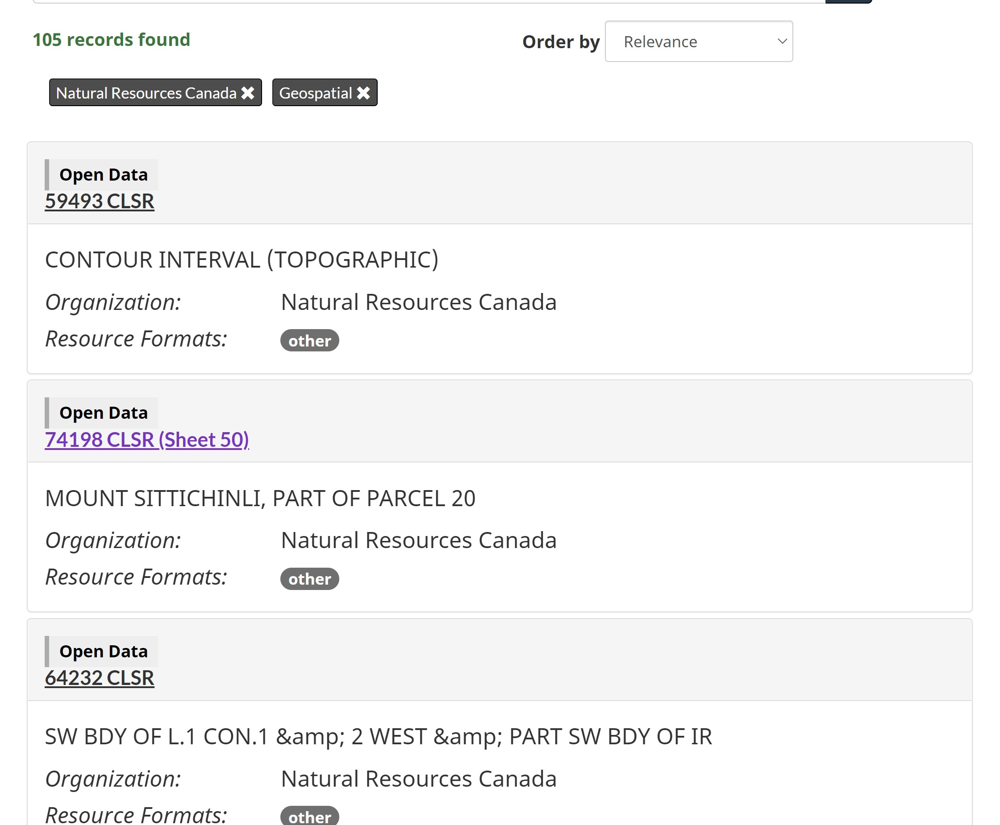

```{r setup, include=T, message=FALSE, warning = FALSE}
knitr::opts_chunk$set(echo = TRUE, message=FALSE, warning = FALSE)
library(knitr)
library(tidyverse)
library(purrr)
library(jsonlite)
library(ggplot2)
library(dplyr)
library(readxl)
library(openxlsx)
library(tidyverse)
library(plyr)
library(gtools)
#Importing the packages we need to use and setting the option on how the output looks
```

## Overview

The Geogratis collection type represents a significant portion of the dataset records on the Open Government Portal. These legacy records published by NRCan come from a system that no longer exists within the department, and have a significant number of broken links and other issues. Additionally the way these records were added to the catalogue makes it difficult for a user to find the geogratis product that are looking for. 

### Content description

There are 1000s of map tiles within the catalogue, that have non-user friendly names, and limited metadata to support findability. For example we can look at some of the search results for geogratis records:

{width=50%}


If we look at one of those records we can see that it is a small portion of a larger map. This is a scan of a paper document, and there are 1000s of these similar scanned paper maps in the system.


{width=50%}

<br>
NRCan will be replacing these individual map tile records with modern mapping services that allow a user to look at a interactive map, then select which areas they want to extract different types of maps for. This improved user experience should make mapping products easier to find, as well as remove the clutter of 10,000s of rarely used records from the portal. 


## Impact

```{r}

UUIDs<-as.data.frame(readLines("SGB-UUID-to-delete.txt")) #Reading in the list of records NRCan sent us, and converting it to a dataframe
count_UUIDs<-nrow(UUIDs) #getting a count for how many records there are
names(UUIDs)<-c("ID") #storing the number as a variable to use within the text of the document
```

<br>
NRCan is decommissioning the server that hosts the `r count_UUIDs` datasets. They are targeting early summer to have this legacy sever decomissioned.

```{r}
R.utils::gunzip("od-do-canada.jsonl.gz", remove=F) #taking the metadata catalogue jsonlines and gunzipping
query1<-readLines("od-do-canada.jsonl") #reading it into R line by line
lines <- lapply(query1,unlist) #converting it from a bunch of list objects to json
num_recs<-length(lines) #getting the number of records currently on the portal
```

```{r}
percent_recs<-(count_UUIDs/num_recs)*100 #calculating the percent of overall records to be removed
percent_recs<-round(percent_recs,digits=0) #rounding that to a whole number
```

<br>
As of 2021-04-07 these records represent `r percent_recs`% of the current number of records on the portal.

```{r warning=FALSE}
#initialiing a dataframe with the elements we want from our json, for our 1st line
q1<-fromJSON(lines[[1]])
ID<-q1$id
org<-q1$organization$name
collection<-q1$collection
date_created<-q1$metadata_created
date_last_mod<-q1$metadata_modified
q1data<-data.frame(ID,org,collection,date_created,date_last_mod)
names(q1data)<-c("ID","org","collection","date_created","date_last_mod")
for(i in 2:length(lines)){ #loop over this for each line of json - except the 1st line, append each line to the dataframe
q1<-fromJSON(lines[[i]])
ID<-q1$id
org<-q1$organization$name
collection<-q1$collection
date_created<-q1$metadata_created
date_last_mod<-q1$metadata_modified
q1data<- q1data %>% add_row(ID,org,collection,date_created,date_last_mod)
}

```
<br>
The current breakdown of records on the portal is as follows:

```{r}

#create a plot of the current records, grouped by collection type
ggplot(q1data, aes(x=collection)) + geom_bar(alpha=0.5,stat="count") + stat_count(geom = "text", colour = "blue", size = 3.5,
aes(label = ..count..),position=position_stack(vjust=0.5)) + 
theme(axis.text.x = element_text(angle = 60, vjust = 1, hjust=1))
```

```{r}


df2<-anti_join(q1data, UUIDs, by = "ID") #creating a new dataframe with the list of records removed
new_total<-nrow(df2) #getting a new total of the number of records on the portal
#plotting the new number of records grouped collection type
ggplot(df2, aes(x=collection)) + geom_bar(alpha=0.5,stat="count") + stat_count(geom = "text", colour = "blue", size = 3.5,
aes(label = ..count..),position=position_stack(vjust=0.5)) + 
theme(axis.text.x = element_text(angle = 60, vjust = 1, hjust=1))
```

<br>
When the `r count_UUIDs` Geogratis records from NRCan are removed the breakdown will be as above, excepting that additional records from other catalogue types may be added or removed based on normal operations.That will leave us with `r new_total` records on the portal. 


## Analytics


```{r }
#load in our downloads data, then get rid of the tabs we don't want
wb<-loadWorkbook("downloads-032020-032021.xlsx")
removeWorksheet(wb, 1)#remove the unwanted tabs
removeWorksheet(wb, 1)#do it again for the 2nd unwanted
saveWorkbook(wb,"downloads.xlsx", overwrite = T)

path<-"downloads.xlsx"
dls<-lapply(excel_sheets(path), read_excel, path = path) #read in the data from the 86 remaining tabs of the workbook

#make a dataframe with our downloads data
dl_df<-map_dfr(dls,`[`, c("ID / Identificateur","Title English / Titre en anglais","Number of downloads / Nombre de téléchargements"))
dl_df<-na.omit(dl_df)
dl_df$`Title English / Titre en anglais`<-NULL
names(dl_df)<-c("ID","downloads") 

#do a left join between the list records on the portal and their downloads data, based on UUID 
combined<-merge(x = q1data, y = dl_df, by = "ID", all.x = TRUE)
combined<-na.replace(combined,0)

#summarize the downloads data by collection type
collection_mean<-ddply(combined, .(combined$collection), summarize, mean_downloads=mean(downloads))
collection_counts<-ddply(combined, .(combined$collection), summarize, count_downloads=sum(downloads))
collection_dls<-cbind(collection_mean,collection_counts$count_downloads)
names(collection_dls)<-c("Collection","Mean Downloads","Count Downloads")
#output a nicely formatted table in the document
kable(collection_dls, caption="Downloads and Average Downloads by Collection Type - FY2020-21")


```
<br>
Based on our downloads data from 2020-04-01 to 2021-03-31 (FY 2020-21) we can see that Geogratis gets a small percentage of the downloads from the portal, even though it represents a huge portion of the overall number of records. 

```{r }
#change the collection type of be of type factor, then copy just the geogratis data to a new dataframe
combined$collection<-as.factor(combined$collection)
geogratis_dls<-subset(combined, collection=="geogratis") %>% arrange(desc(downloads))
unused<-nrow(geogratis_dls)-1911 #calculate number of unused datasets
avg_geogratis<-round(mean(geogratis_dls$downloads), digits=3)
```
We can also see that only 1,911 out of the geogratis records received any downloads in FY2020-21, meaning `r format(unused, scientific=FALSE)` geogratis datasets were not downloaded a single time during the past fiscal year.

<br>
Since so many of the datasets received zero downloads, removing them from the portal is likely going to have minimal impact on KPIs we monitor for the portal such as number of page views and downloads.

```{r}
remove_dls<-merge(x = geogratis_dls, y = UUIDs, by = "ID", all.y = TRUE)
remove_dls<-na.replace(remove_dls,0) %>% arrange(desc(downloads))
max_remove<-max(remove_dls$downloads)
avg_remove<-round(mean(remove_dls$downloads),digits=3)
```

<br>
Looking at the number of downloads within the group of datasets scheduled to be removed, the top dataset in that collection got `r max_remove` downloads. The average number of number of downloads per dataset in this group is `r avg_remove`. This is far lower than the geogratis collection overall, with an average downloads per dataset of `r avg_geogratis`. 

```{r}


ggplot(remove_dls[1:412,], aes(downloads)) + geom_histogram(bins=100)+labs(title="Datasets to be Removed by Count of Number of Downloads - FY2020-21")+scale_x_continuous(name="number of downloads", breaks=c(1,2,3,4,5,6,7,8,9,10,11,12,13,14,15,16,17,18,19,20,21,22,23,24,25))+stat_count(geom = "text", colour = "blue", size = 8,
aes(label = ..count..),position=position_stack(vjust=0.5))
```


```{r }

#delete the jsonlines file from the directory so it doesn't throw an error when I regenerate the report next time
if (file.exists("od-do-canada.jsonl")) {
  #Delete file if it exists
  file.remove("od-do-canada.jsonl")
} 
```


